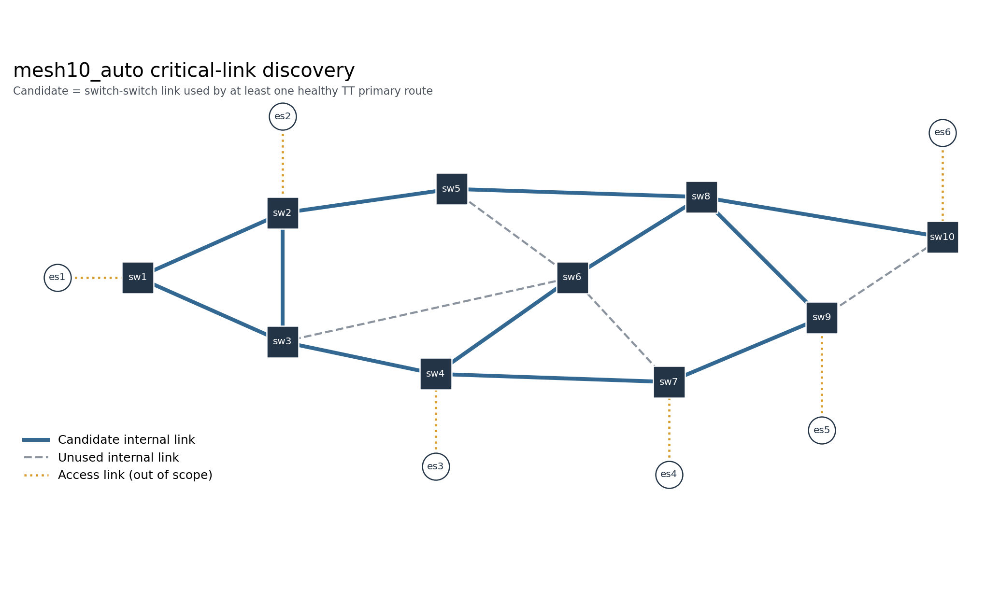
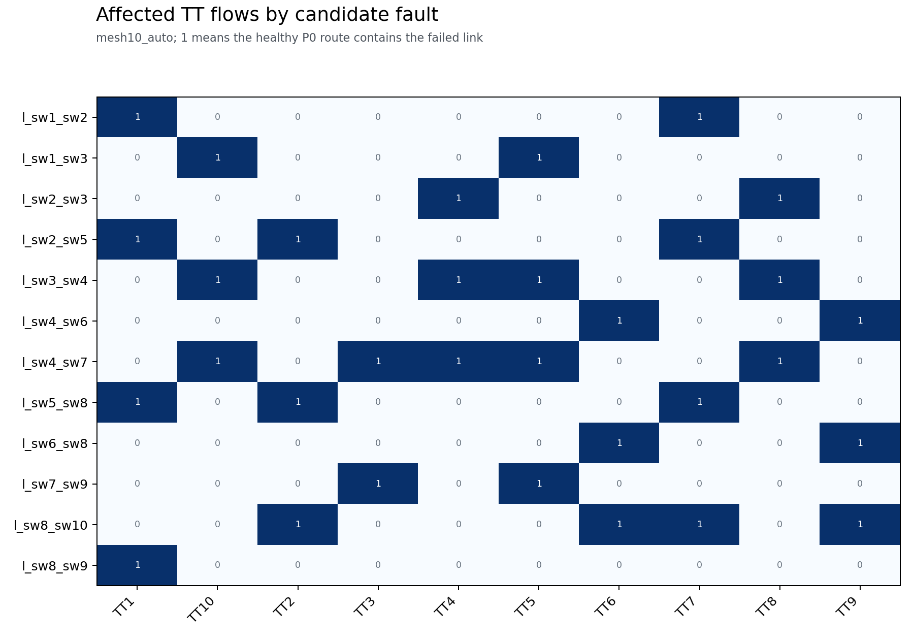
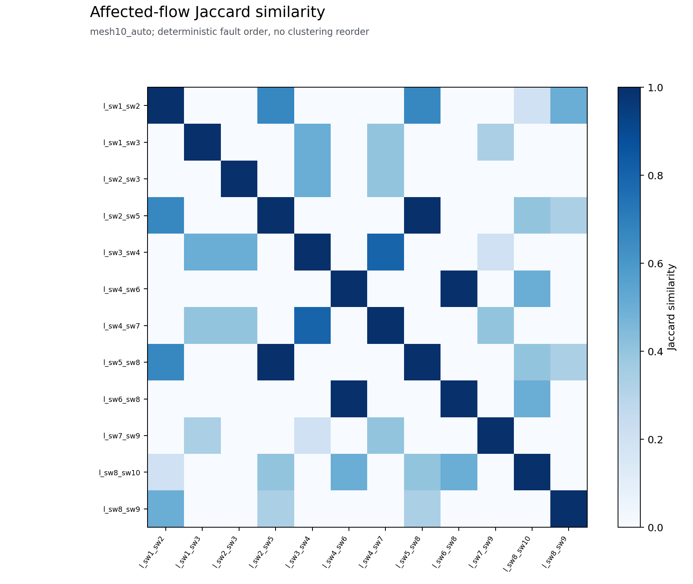
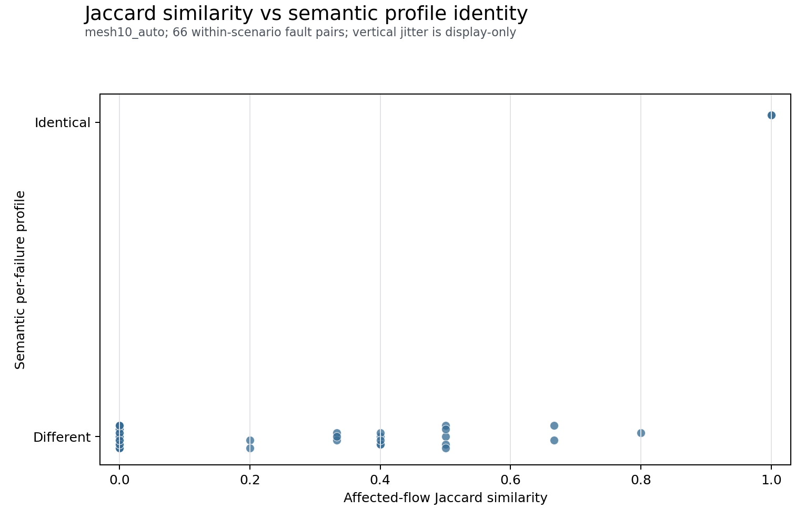

# Critical-Link Discovery and Fault Similarity Dataset

## Technical summary

Healthy P0 routes selected 2 of 4 Diamond internal links and 12 of 16 mesh10 internal links. All 14 candidates entered per-failure recovery; none was filtered by recoverability and all happened to be SAT in this dataset.

The resulting similarity data are exploratory diagnostics, not recovery equivalence classes. Affected-flow Jaccard describes overlap in P0 impact only; semantic profile identity compares complete per-failure route, forwarding, and gate semantics.

## Candidate coverage

| Scenario | Physical links | Switch-switch | P0-used candidates | Unique affected sets | Unique profile hashes |
|---|---:|---:|---:|---:|---:|
| Diamond auto | 6 | 4 | 2 | 1 | 1 |
| mesh10 auto | 22 | 16 | 12 | 10 | 10 |

Access links are out of the current protection scope because end systems are single-homed. An out-of-scope or P0-unused link is not unimportant: a P0-unused internal link can be essential as a recovery path.

## Impact structure and similarity

Across the two scenarios there are 67 within-scenario unordered pairs. Among the 3 pairs with Jaccard = 1, 3 also produced identical semantic profiles. This is an observation for these scenarios only and does not establish a general implication.

## Definitions and method

For each physical link e, A(e) is built in one pass over healthy P0 logical route link paths. Auto candidates satisfy both switch-switch scope and |A(e)| > 0. Payload rate is packet_size_bytes × 8 / period. Candidate discovery has no access to recovery status, recovered routes, solver objectives, or semantic hashes.

Affected-flow Jaccard is |A(i) ∩ A(j)| / |A(i) ∪ A(j)|. Fault edge distance is the minimum healthy switch-graph node distance over the four endpoint pairs; shared endpoints therefore have distance 0. Primary path position difference is the mean absolute zero-based link-index difference for flows affected by both faults. Recovery-route Jaccard uses the union of all recovered TT route links and is present only for SAT pairs.

## Limitations and robustness

Candidate artifacts, ordering, hashes, incidence matrices, and Jaccard matrices are deterministic and checked by repeat execution. Wall-clock solver timings are measured evidence and are not expected to be byte-identical. Both scenarios are small and all auto candidates are SAT, so this dataset cannot estimate failure-mode prevalence or statistical predictive power. No clustering, shared Profile synthesis, deduplication, or compression ratio is claimed.

## Recommended next step

Use affected-flow overlap together with topology and route features only to propose candidate groups. A group becomes a Recovery Equivalence Class only after one shared robust Profile is synthesized and validated for forwarding, connectivity, schedule feasibility, end-to-end deadlines, and deterministic recovery under every fault in that group.

## Further questions

A larger structured scenario is needed to test whether the mesh10 patterns persist, including non-SAT candidates and repeated affected sets with different semantic profiles. That extension should preserve the same no-leakage discovery policy.
