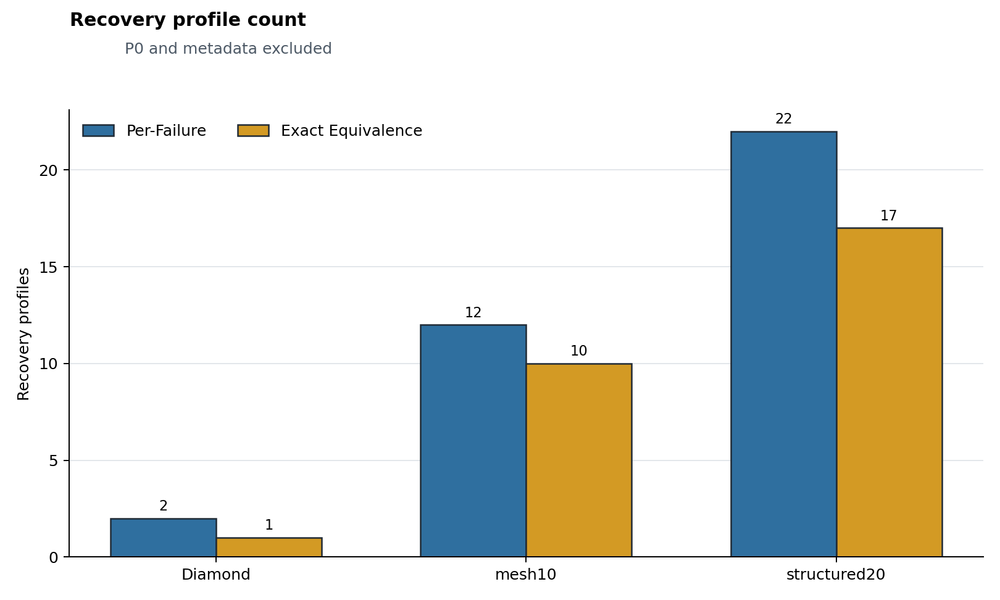
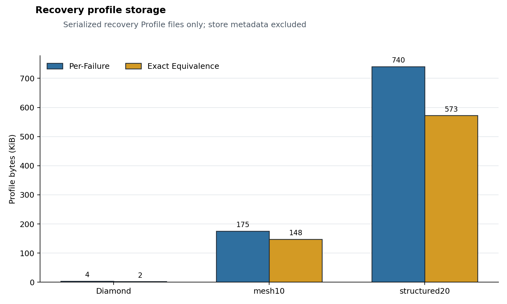
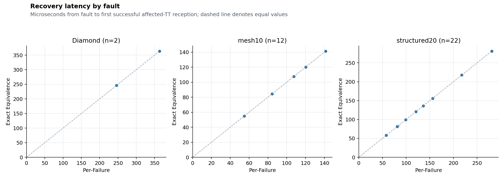
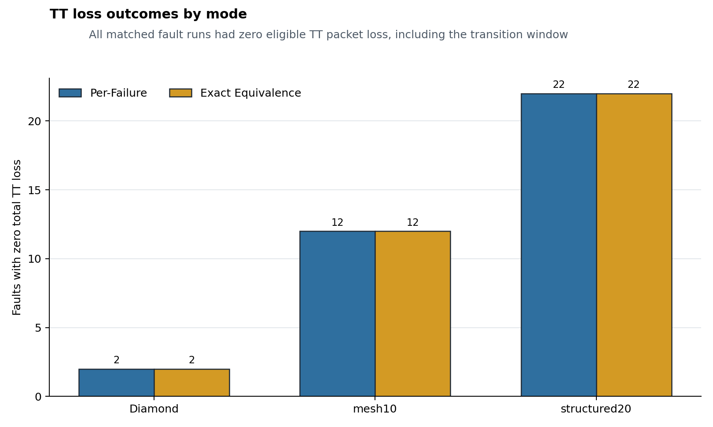
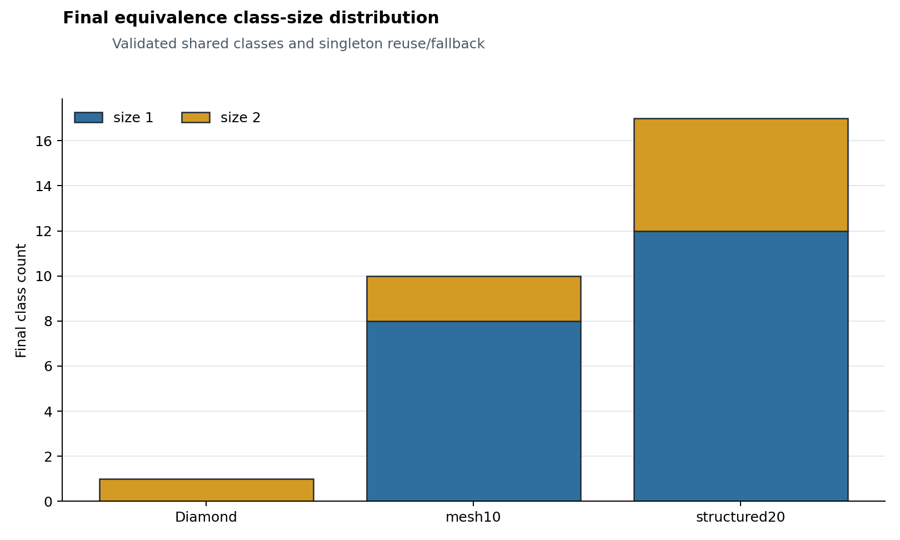
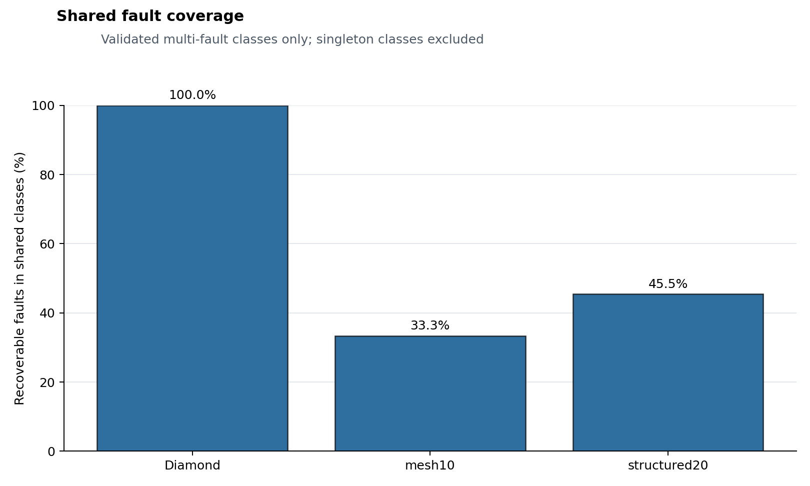

# Exact affected-set recovery equivalence

## Technical summary

- **Diamond:** 2 recoverable faults became 1 validated recovery Profiles; profile-count compression 50.0%, storage compression 45.7%, shared-fault coverage 100.0%.
- **mesh10:** 12 recoverable faults became 10 validated recovery Profiles; profile-count compression 16.7%, storage compression 15.9%, shared-fault coverage 33.3%.
- **structured20:** 22 recoverable faults became 17 validated recovery Profiles; profile-count compression 22.7%, storage compression 22.7%, shared-fault coverage 45.5%.

All reported multi-fault classes were synthesized independently on the union-disabled topology and then exercised under each member as a separate single-link runtime fault. Candidate grouping used only exact healthy-P0 affected-flow sets; semantic hashes did not decide membership.

## Compression evidence

Profile count compares SAT Per-Failure recovery Profiles with the final validated partition. Storage counts only serialized recovery Profile files; P0, Class Store metadata and report files are excluded.

## Runtime quality remained valid in all matched runs

Across all 36 matched faults, both modes had zero eligible TT packet loss and zero delivered deadline misses. The maximum absolute recovery-duration delta was 0.000 μs. 6 faults in shared classes used a robust semantic Profile different from their Per-Failure baseline, demonstrating that class construction was not hash deduplication.

The stable post-recovery window begins at activation plus one 1 ms cycle. Validation requires activation, failed-link avoidance, forwarding validity, zero runtime BFS/Z3/synthesis, stable delivery without persistent loss, and zero delivered deadline misses.

## Class structure reflects naturally repeated affected sets

The 4×5 structured20 grid has 20 switches, 10 end systems, 45 physical links, 20 TT flows and 4 BE flows. Automatic healthy-P0 discovery selected 22 of 35 internal links and produced 17 exact groups, including five validated multi-fault groups; topology and traffic were fixed before discovery.

Candidate groups are not equivalence classes. A multi-fault group is reported as validated only after one identical Profile SHA passes every member simulation; failed synthesis or validation conservatively falls back to Per-Failure singleton Profiles.

## Offline cost is reported separately from the baseline

- **Diamond:** Per-Failure precompute 24.730 ms; additional exact-class synthesis 9.857 ms. These measured wall times are not used in candidate selection.
- **mesh10:** Per-Failure precompute 601.719 ms; additional exact-class synthesis 117.615 ms. These measured wall times are not used in candidate selection.
- **structured20:** Per-Failure precompute 5070.624 ms; additional exact-class synthesis 1146.634 ms. These measured wall times are not used in candidate selection.

## Scope and limitations

The experiment covers deterministic single-link failures, one TT class, one 1 ms hyperperiod, BFS routing and one fixed shared forwarding/GCL state. Union removal is an offline robustness construction, not a simultaneous multi-link runtime fault. All candidates and shared synthesis attempts happened to be SAT, so failure-mode prevalence is not estimated. Results do not establish that exact affected sets are generally sufficient for equivalence.

## Recommended next step

Use the robust synthesis and per-member validation pipeline as the acceptance test for approximate candidate groups proposed from Jaccard, edge distance and route features; similarity alone must never establish equivalence.

## Further questions

Larger or stressed scenarios should test failed exact groups, solver timeout behavior and the compression-quality frontier without changing candidate selection after observing outcomes.
