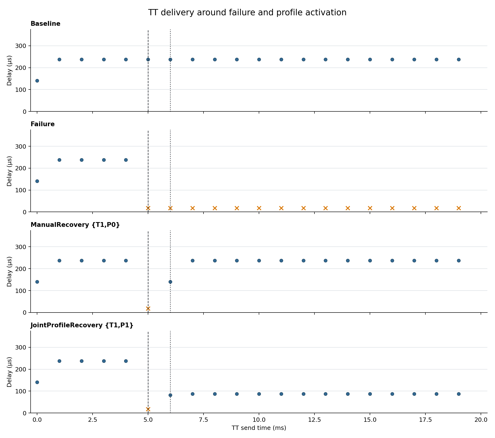

# Joint profile activation — Phase A

This experiment validates a runtime data-plane mechanism, not the final thesis algorithm. At 6 ms one activation changes S1 forwarding and six TT/BE PeriodicGate parameter sets for the three backup-path egresses; all gate values pass immediate readback.

| Scenario | TT received / eligible | TT lost | BE received | First post-fault success | Recovery (µs) |
|---|---:|---:|---:|---:|---:|
| Baseline | 20 / 20 | 0 | 98 | N/A | N/A |
| Failure | 5 / 20 | 15 | 24 | N/A | N/A |
| ManualRecovery {T1,P0} | 19 / 20 | 1 | 92 | 6 | 1140.740 |
| JointProfileRecovery {T1,P1} | 19 / 20 | 1 | 92 | 6 | 1081.800 |

The manually configured P1 is a 1 ms pipeline: s1.eth[2] opens TT at 0–100 µs, s3.eth[1] at 100–200 µs, and s4.eth[2] at 200–300 µs; BE is complementary at each egress.

Joint recovery first succeeds at 6.081800 ms (sequence 6), 81.800 µs after activation. ManualRecovery remains the routing-only {T1,P0} regression/ablation and delivered TT/BE 19/92.

Activation has scheduling priority -100. OMNeT++ orders equal-time events by lower numeric scheduling priority before insertion order, so activation precedes the 6 ms source production event (default priority 0).

Raw input: `/home/opp_env/tsn_fault_recovery/experiments/exp02_joint_profile_activation/raw/20260828T141238256256862Z`.
