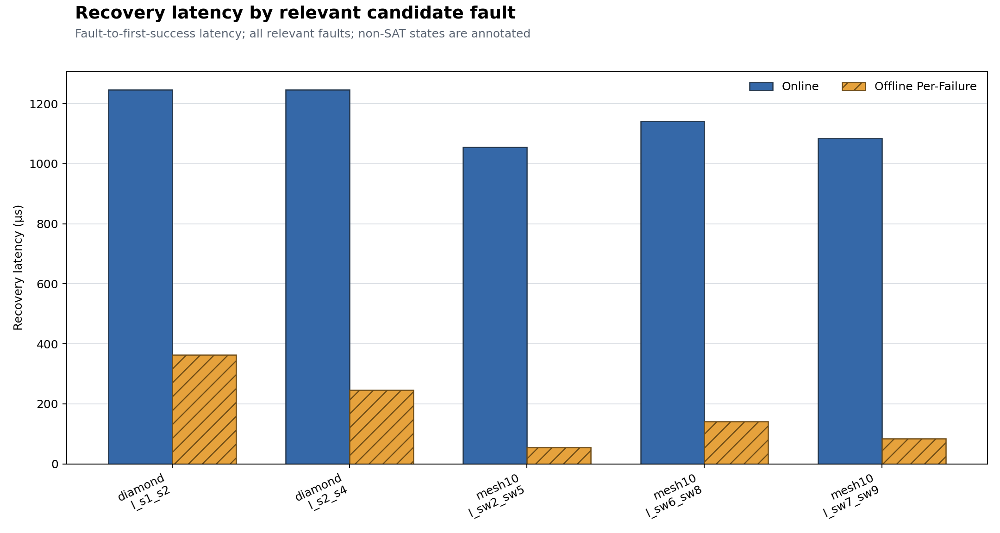
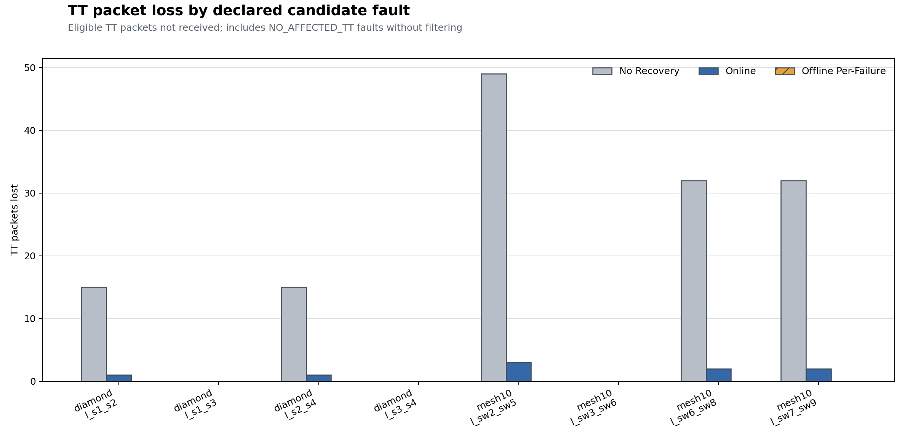

# Offline Per-Failure Joint Profile Recovery

## Technical summary

The formal sweep evaluates every declared single-link candidate in Diamond and mesh10 from the same clean implementation commit. Offline Per-Failure preloads one independently serialized joint Profile for every SAT relevant fault and performs no runtime BFS or Z3 calls.

## Recovery and loss evidence

`recovery_latency_by_fault.png` compares fault-to-first-success latency for all relevant SAT faults. `tt_loss_by_fault.png` retains every declared candidate, including no-action faults.

| Scenario | Mode | Mean TT loss | p95 TT loss | Mean recovery (µs) | p95 recovery (µs) | Deadline-miss ratio |
|---|---:|---:|---:|---:|---:|---:|
| diamond | no-recovery | 7.500 | 15.000 |  |  | 0.000000 |
| diamond | online | 0.500 | 1.000 | 1246.320 | 1246.320 | 0.000000 |
| diamond | offline-per-failure | 0.000 | 0.000 | 304.960 | 357.736 | 0.000000 |
| mesh10 | no-recovery | 28.250 | 46.450 |  |  | 0.000000 |
| mesh10 | online | 1.750 | 2.850 | 1093.589 | 1135.648 | 0.000000 |
| mesh10 | offline-per-failure | 0.000 | 0.000 | 93.589 | 135.648 | 0.000000 |

## Profile coverage and offline cost

| Scenario | Candidates | Relevant | SAT | No affected | No route | UNSAT | Recovery bytes | Precompute (ms) |
|---|---:|---:|---:|---:|---:|---:|---:|---:|
| diamond | 4 | 2 | 2 | 2 | 0 | 0 | 3999 | 23.391 |
| mesh10 | 4 | 3 | 3 | 1 | 0 | 0 | 44522 | 163.775 |

## Scope and metric definitions

Recovery latency is `T_first_success - T_fault`; deadline misses count delivered TT packets exceeding their configured end-to-end deadline. Offline lookup delay is an explicit simulated control-plane parameter and defaults to the ideal preloaded lower bound of 0 µs. Wall-clock lookup, BFS, and Z3 times never advance simulation time.

## Method and validation

Each affected flow is rerouted with deterministic BFS on the fault-disabled graph; unaffected routes remain identical to P0. All active TT flows are jointly scheduled by the same Z3 model used online, compiled into a complete GCL/Profile, checked for destination-MAC forwarding realizability, and activated through the shared ProfileSwitcher. Every online SAT Profile matched its offline counterpart by semantic hash.

## Limitations and robustness

The experiment models instantaneous fault detection and an ideal 0 µs preloaded lookup; the additional 100 µs sensitivity run is reported separately. Results are deterministic simulation outcomes, not controller hardware measurements. Destination-MAC forwarding conflicts are rejected rather than solved with a stream-aware data plane.

## Recommended next step

Use these independent per-fault Profiles as the uncompressed baseline for the next-stage Fault Equivalence Classification study; do not interpret duplicate semantic hashes as an implemented equivalence class.

## Further questions

The next study should test how much recovery-profile count and storage can be reduced while preserving schedulability, TT loss, deadline compliance, and recovery latency.
