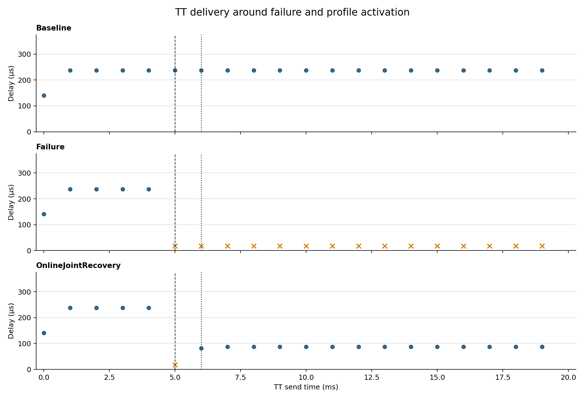

# Online joint recovery — Phase B

After the 5 ms disconnect, the online solver reads the live topology, runs deterministic BFS, obtains `s1 -> s3 -> s4 -> destination`, derives all forwarding entries and route-length-dependent pipeline gates, and returns the same ProfileDefinition consumed by Phase A's activator.
The current single configured TT flow is the affected-flow set. The abstraction keeps fault data, affected-flow/scheduling input, solver output, and activation separate; replacing only the solver backend does not change data-plane activation.

TT/BE received: **19/92**. First successful post-fault TT is sequence 6 at 6.081800 ms; total recovery is 1081.800 µs.

| Timing component | Value | Clock domain |
|---|---:|---|
| Solver execution | 31.903 µs | host wall clock |
| Configured solverDelay | 1.000 ms | simulation time |
| Synchronous activation event | 0.000 µs | simulation time |
| Activator execution | 43.168 µs | host wall clock |
| Activation to first success | 81.800 µs | simulation time |

The measured C++ wall-clock duration does not advance OMNeT++ time. `solverDelay=1 ms` is the explicit control-plane latency model; it is configured independently from the observed host runtime.

Raw input: `/home/opp_env/tsn_fault_recovery/experiments/exp03_online_joint_recovery/raw/dev_exp03`.
