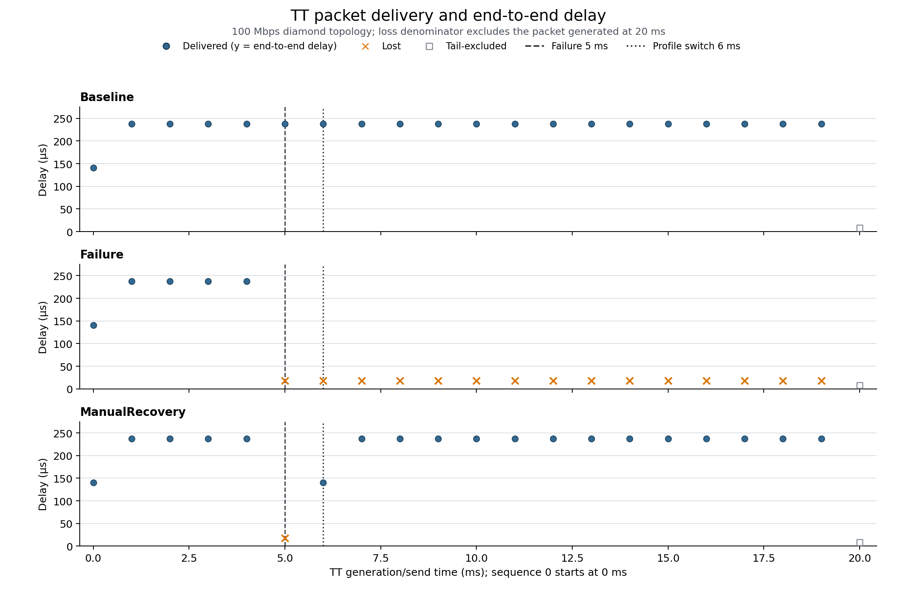

# TSN fault-recovery measurement report

## Technical summary

The native INET result signals are sufficient for deterministic per-packet TT matching, so no collector was inserted into the forwarding path. With a 1 ms drain window, Baseline delivered all 20 eligible TT packets, Failure delivered 5 and lost 15, and ManualRecovery delivered 19 and lost 1. ManualRecovery's first post-fault success was sequence 6 at 6.140740 ms: 1,140.740 µs after the fault and 140.740 µs after the profile switch.

## Manual profile switching restores TT delivery after one eligible loss

The table separates raw sends from the delivery denominator. The packet generated exactly at the 20 ms simulation limit is retained in the packet CSV but excluded from loss calculations.

| Scenario | Raw TT sent | Eligible TT sent | TT received | TT lost | Loss ratio | First lost seq after fault | First successful seq after fault |
|---|---:|---:|---:|---:|---:|---:|---:|
| Baseline | 21 | 20 | 20 | 0 | 0.000% | N/A | N/A |
| Failure | 21 | 20 | 5 | 15 | 75.000% | 5 | N/A |
| ManualRecovery | 21 | 20 | 19 | 1 | 5.000% | 5 | 6 |

Delivered packets are plotted at their end-to-end delay. Orange crosses mark eligible losses; the open square at 20 ms is the deliberately excluded simulation-tail packet. Failure and profile-switch references are shown at 5 ms and 6 ms.

## Recovery timing uses arrival time, not switch time

`T_recovery` is the first successful TT arrival after the fault minus the fault occurrence time. `T_switch_to_first_success` uses the same arrival but subtracts the profile-switch time; the two metrics therefore differ by exactly 1 ms in this experiment.

| Recovery metric | ManualRecovery |
|---|---:|
| Fault time | 5.000 ms |
| Profile-switch time | 6.000 ms |
| First successful TT sequence after fault | 6 |
| First successful TT arrival | 6.140740 ms |
| Recovery interruption duration | 1140.740 µs |
| Switch-to-first-success | 140.740 µs |
| TT packets lost during outage | 1 |

## Stable post-recovery delay matches the time-aligned baseline

Pre-fault statistics use TT packets generated before 5 ms. Stable post-recovery statistics begin at 7 ms, one complete 1 ms TAS cycle after the profile switch; the packet generated during 6–7 ms is classified as `recovery_transition` and excluded from stable-delay statistics.

| Scenario | Window | Mean (µs) | p50 (µs) | p95 (µs) | Max (µs) |
|---|---|---:|---:|---:|---:|
| Baseline | pre-fault | 218.268 | 237.650 | 237.650 | 237.650 |
| Baseline | stable post-recovery/time-aligned | 237.650 | 237.650 | 237.650 | 237.650 |
| Failure | pre-fault | 218.268 | 237.650 | 237.650 | 237.650 |
| Failure | stable post-recovery/time-aligned | N/A | N/A | N/A | N/A |
| ManualRecovery | pre-fault | 218.268 | 237.650 | 237.650 | 237.650 |
| ManualRecovery | stable post-recovery/time-aligned | 237.650 | 237.650 | 237.650 | 237.650 |

ManualRecovery's post-vs-pre mean increase is 19.382 µs (8.880%), while p95 and max degradation are 0.000 µs and 0.000 µs. The mean difference is caused by the shorter startup packet at t=0 in the five-packet pre-fault sample; the stable post-recovery mean is identical to Baseline over the same ≥7 ms window (0.000 µs difference).

## Scope, data, and metric definitions

- Environment: OMNeT++ 6.4.0 + INET 4.7.0, 100 Mbps Ethernet links.
- TT in this project means periodic UDP traffic (1 ms, 200 B) classified with PCP 4 into TAS traffic class 1. BE is periodic UDP traffic (200 µs, 1400 B) with PCP 0. This is not a complete industrial IEEE TSN TT model.
- Sequence identity is zero-based source send order; sequence 0 is generated at t=0.
- `packetSent:vector(packetBytes)` supplies source send timestamps. Destination `packetLifeTime:vector` supplies receive timestamps and end-to-end lifetime. A receive is matched to the unique send satisfying `receive_time - lifetime == send_time` within 1 ns.
- Simulation end is 20 ms. The 1 ms drain rule makes sends at or before 19 ms loss-eligible; the send at 20 ms remains visible but is not counted as loss.
- Percentiles use linear interpolation at rank `(n - 1) × p`.
- Phases are `pre_fault` (<5 ms), `outage` (5–6 ms), `recovery_transition` (6–7 ms), and `post_recovery` (≥7 ms).

## Methodology and reproducibility

The experiment entry builds the existing executable in release mode, runs General/Baseline, LinkFailure, and ManualRecovery under Cmdenv with the IDE-derived NED and image paths, then invokes the Python analyzer on a timestamped raw-result directory. The analyzer cross-checks vector-derived TT delivery against application scalars and enforces the expected TT/BE regression counts.

Raw input for this report: `/home/opp_env/tsn_fault_recovery/experiments/exp01_recovery_metrics/raw/20260828T131031Z`.

## Regression and robustness checks

| Scenario | TT received (expected / actual) | BE received (expected / actual) | Result |
|---|---:|---:|---|
| Baseline | 20 / 20 | 98 / 98 | PASS |
| Failure | 5 / 5 | 24 / 24 | PASS |
| ManualRecovery | 19 / 19 | 92 / 92 | PASS |

All checks pass. No NED topology, application parameters, TAS GCL, forwarding code, or ProfileSwitcher logic was changed; measurement is post-processing of INET-native result records.

## Limitations, uncertainty, and next step

- Results are deterministic for the current single 20 ms run and configuration; no multi-seed confidence interval is claimed.
- There is no explicit deadline, gPTP clock drift, SMT schedule, or automatic recovery algorithm.
- The 1 ms drain window is conservative relative to the observed sub-0.24 ms TT delay and prevents the t=20 ms tail artifact; changing topology, link rate, or GCL should trigger a review of this window.
- The next stage should keep the current precomputed forwarding profile `T1` and add a genuinely independent backup-path GCL `P1`, moving from `Profile1 = {T1, P0}` to `Profile1 = {T1, P1}`. This report does not start that work.

## Further questions

Before later SMT automation, determine whether the backup-path GCL should optimize worst-case TT delay, guard-band overhead, or recovery robustness across multiple failure locations, and define the validation horizon/seeds needed for those comparisons.
