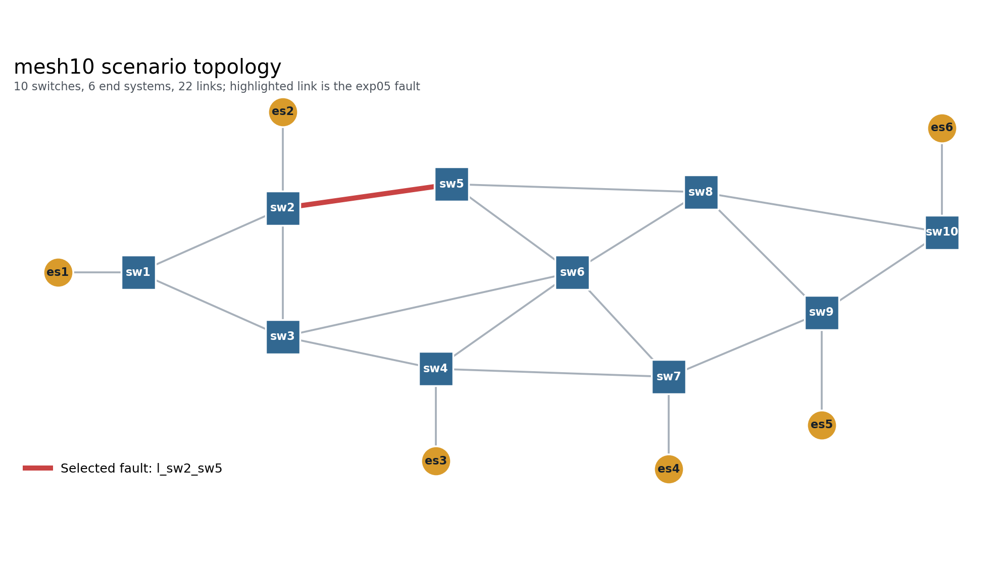

# Scenario-Driven Experiment Framework v1

## Result

The same YAML→canonical model→generated NED/INI→P0→runner pipeline completed Diamond and mesh10 in NoRecovery and Online modes. Diamond Online reduced TT loss from 15 to 1; mesh10 Online reduced TT loss from 49 to 3 with zero delivered deadline misses.

## mesh10 fault behavior

For `l_sw2_sw5`, TT1, TT2, and TT7 were affected and independently rerouted. The other seven TT routes were byte-for-byte preserved. All ten active TT routes were jointly rescheduled, so recovery did not ignore contention with unaffected traffic.

## Runtime boundary

The mesh10 online route, SMT, and activation wall times were 43.432 µs, 54645.121 µs, and 121.223 µs. The configured simulation-time solver delay was 1.000 ms.

## Scope

`offline-per-failure` and `offline-cluster` are intentionally `NOT_IMPLEMENTED`. SMT SAT constrains the schedule budget through the last controlled egress; packet traces independently verify the end-to-end application deadline.
