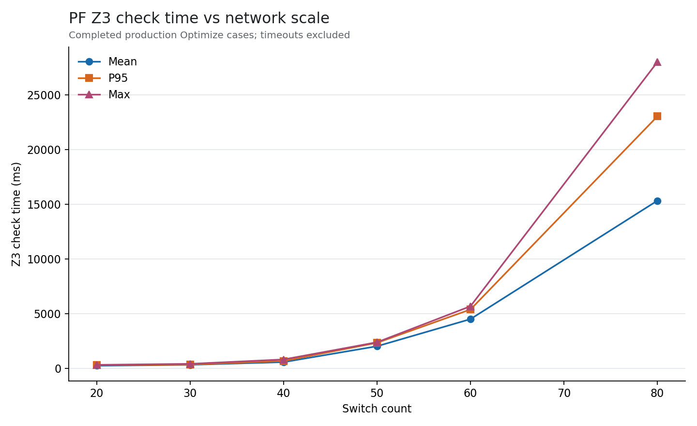
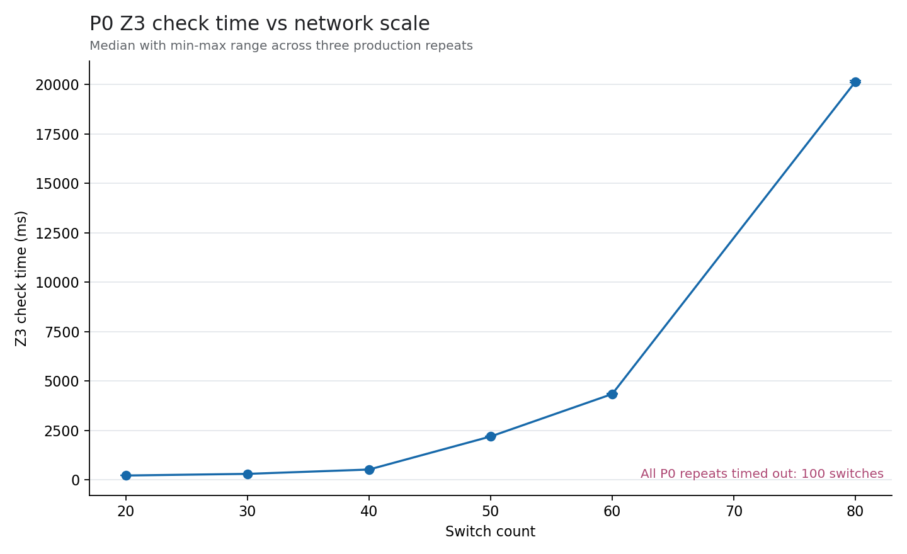
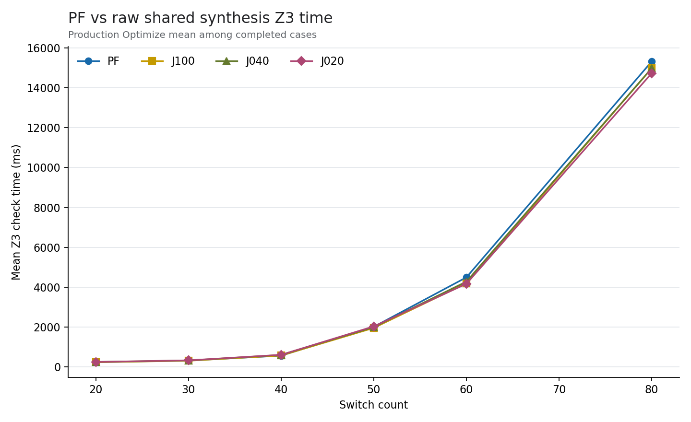
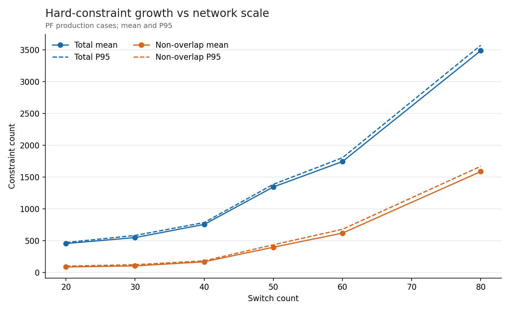
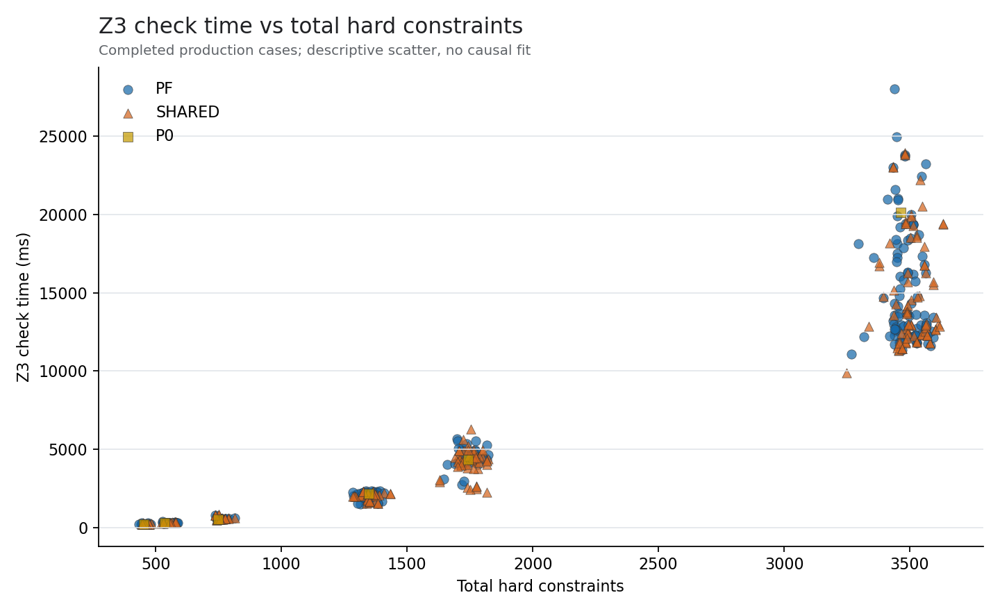
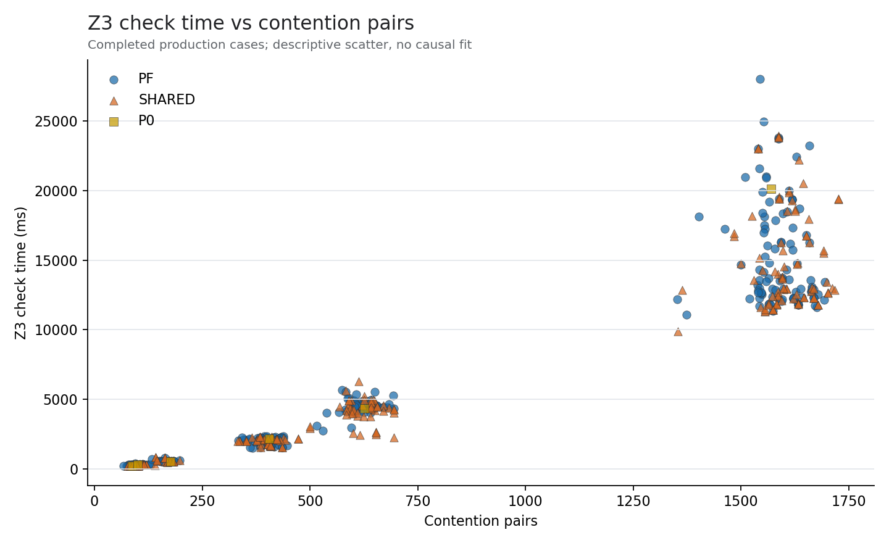
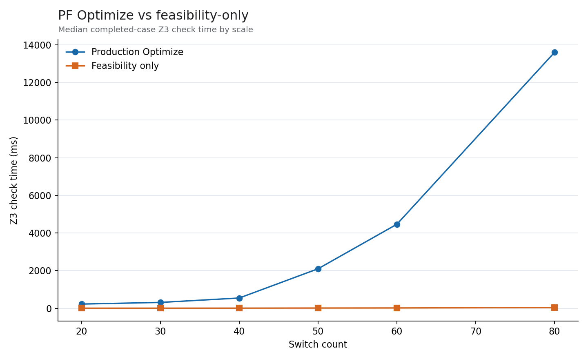
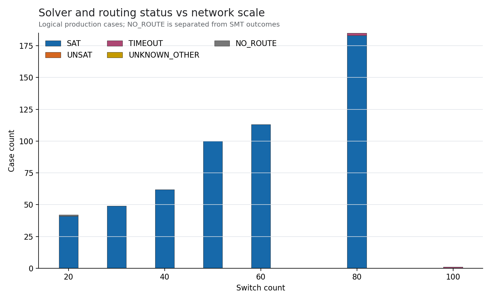

# SMT Solver Scalability and Model Complexity Characterization

## Technical summary

Under the fixed 30-second bound, the campaign covered 7 structured scales from 20 to 100 switches. Among completed P0 runs, median Z3 time rose from 216.28 ms at 20 switches to 20146.88 ms at 80; P0 at 100 switches was TIMEOUT. The last scale with completed PF cases was 80 switches, with mean/P95/max 15323.64/23037.09/28005.11 ms.

Observed production outcomes included 3 TIMEOUT, 0 UNKNOWN_OTHER, and 0 UNSAT logical cases. These are empirical outcomes under one machine and fixed timeout, not a theoretical complexity bound. The evidence may justify targeted investigation of solver optimization; it does not support introducing GA.

## Key findings

- P0 scaling: 20=216.28 ms; 30=299.00 ms; 40=518.50 ms; 50=2191.06 ms; 60=4339.59 ms; 80=20146.88 ms; 100=NA ms.
- PF scaling (mean/P95/max ms): 20=230.70/296.66/306.14; 30=312.84/338.23/398.31; 40=557.42/656.67/800.36; 50=2008.20/2325.27/2374.12; 60=4490.46/5371.68/5667.84; 80=15323.64/23037.09/28005.11; 100=NA/NA/NA.
- Optimize overhead ratio across comparable completed cases: median 200.69, P95 495.76, max 747.15.
- Descriptive Spearman association with Z3 time: total constraints ρ=0.943, non-overlap constraints ρ=0.942, contention pairs ρ=0.942. Association is not causation.

## PF versus raw shared synthesis

- 20 switches — PF/J100/J040/J020 mean Z3 ms: 230.70/228.47/243.85/243.70.
- 30 switches — PF/J100/J040/J020 mean Z3 ms: 312.84/303.90/318.12/324.67.
- 40 switches — PF/J100/J040/J020 mean Z3 ms: 557.42/565.89/597.26/602.54.
- 50 switches — PF/J100/J040/J020 mean Z3 ms: 2008.20/1951.93/1990.25/2028.12.
- 60 switches — PF/J100/J040/J020 mean Z3 ms: 4490.46/4195.11/4275.35/4165.68.
- 80 switches — PF/J100/J040/J020 mean Z3 ms: 15323.64/14984.81/14986.51/14735.77.
- 100 switches — PF/J100/J040/J020 mean Z3 ms: NA/NA/NA/NA.

Raw SHARED groups are synthesis cases only; no member validation or recursive split was performed. A harder J020 instance therefore remains visible instead of being replaced by easier descendants.

## Model structure and observed relationships

The model uses one integer start-time variable per controlled TT hop plus one `maxCompletion` auxiliary integer; explicit ordering Bool count is zero. Hard constraints are counted at insertion time, including cycle bounds, release, hop precedence, deadline, max-completion support, and pairwise non-overlap constraints.

## Optimize versus feasibility-only

Both modes use the same hard-constraint builder. Feasibility-only adds no objectives, never writes a Profile Store, and its schedule is not used as a production profile. Timing ratios are defined only where both modes completed and the feasibility denominator was positive.

## Status frontier and regressions

- 20 switches: P0=SAT; PF SAT/UNSAT/TIMEOUT/UNKNOWN/NO_ROUTE=22/0/0/0/0; SHARED=18/0/0/0/1.
- 30 switches: P0=SAT; PF SAT/UNSAT/TIMEOUT/UNKNOWN/NO_ROUTE=26/0/0/0/0; SHARED=22/0/0/0/0.
- 40 switches: P0=SAT; PF SAT/UNSAT/TIMEOUT/UNKNOWN/NO_ROUTE=32/0/0/0/0; SHARED=29/0/0/0/0.
- 50 switches: P0=SAT; PF SAT/UNSAT/TIMEOUT/UNKNOWN/NO_ROUTE=52/0/0/0/0; SHARED=47/0/0/0/0.
- 60 switches: P0=SAT; PF SAT/UNSAT/TIMEOUT/UNKNOWN/NO_ROUTE=59/0/0/0/0; SHARED=53/0/0/0/0.
- 80 switches: P0=SAT; PF SAT/UNSAT/TIMEOUT/UNKNOWN/NO_ROUTE=98/0/1/0/0; SHARED=84/0/1/0/0.
- 100 switches: P0=TIMEOUT; PF SAT/UNSAT/TIMEOUT/UNKNOWN/NO_ROUTE=0/0/0/0/0; SHARED=0/0/0/0/0.

The structured20/J020 raw union-disabled routing failure is retained as `NO_ROUTE`, not counted as UNSAT. Production-SAT implies feasibility-SAT for every comparable case in the dataset.

## Scope and methodology

Source campaign: run `20260831T035544Z`, implementation `fd67183fd30ba48cd991514935bf7ea284de663e`, serial parallelism=1, Z3 Z3 version 4.16.0 - 64 bit, timeout=30000 ms. P0 production timing uses three repeats and reports the median/range; PF and SHARED use one measurement per logical case. Ordinary timing summaries exclude TIMEOUT/UNKNOWN/NO_ROUTE and include completed SAT/UNSAT only.

## Limitations and robustness

- Wall time is machine- and load-dependent; the dataset supports empirical characterization, not asymptotic complexity claims.
- Native Z3 statistics are version/mode dependent; missing keys are reported as `NOT_AVAILABLE`, never zero.
- No full OMNeT++ member-validation campaign, RSS measurement, incremental solving, decomposition, parallel Z3, GA, or alternate routing was performed.
- Correlations are descriptive and may reflect shared scale drivers or model interactions.

## Evidence-based next recommendation

Optimize is materially slower than feasibility-only in the observed dataset. The next bounded study should test objective simplification or a two-stage feasibility/optimization design; do not implement it without a separate decision.

There remains no evidence here supporting GA or k-shortest-path changes.

## Further questions

- How much model structure is identical across adjacent PF cases, measured independently of an incremental implementation?
- Would an objective-ablation study preserve production schedule semantics while reducing Optimize cost?
- Are the observed associations stable across a second machine or controlled repeated campaign?
