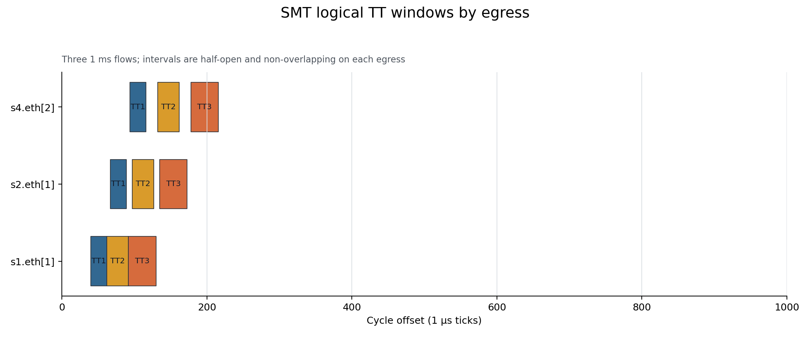
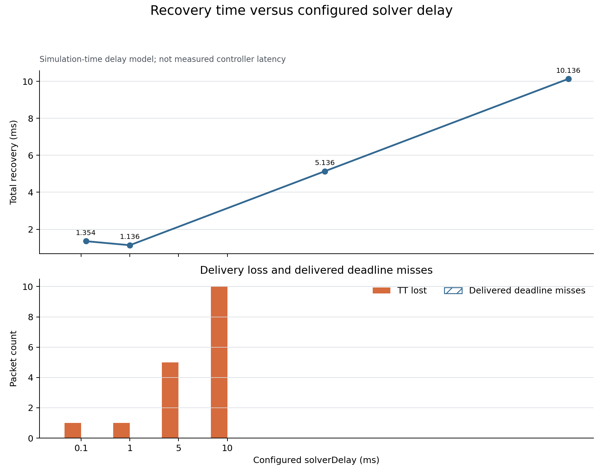

# BFS rerouting with SMT-based TAS rescheduling

## Technical summary

Z3 produced a deterministic SAT schedule for three contending TT flows with maximum completion 216 µs, while the 50 µs deadline case returned UNSAT with the expected lower-bound diagnostic. All delivered packets in the feasible multi-flow case met their configured deadlines. Routing remains BFS-based; Z3 schedules only the fixed route.

## Three contending flows remain non-overlapping and deadline-feasible

The plot shows logical transmission windows, not packet traces. Same-egress windows never overlap; different egresses overlap where pipeline forwarding permits it.

| Flow | Packet | Deadline | Route | Received / eligible | Deadline misses | Mean / max delay |
|---|---:|---:|---|---:|---:|---:|
| TT1 | 200 B | 450 µs | s1->s2->s4->destination | 10 / 10 | 0 | 407.955 / 427.020 µs |
| TT2 | 300 B | 500 µs | s1->s2->s4->destination | 9 / 9 | 0 | 430.117 / 451.300 µs |
| TT3 | 400 B | 550 µs | s1->s2->s4->destination | 9 / 9 | 0 | 462.397 / 483.580 µs |

## The negative case fails for a specific deadline lower bound

`SmtMultiFlowUnsat` returned **UNSAT**. Diagnostic: `minimum route serialization plus hop margins exceeds deadline for flow TT1`. This distinguishes an infeasible model from a simulation or activation failure.

## Recovery tracks configured delay after short-delay cycle-phase effects

The 0.1 and 1 ms cases land at different points in the 1 ms traffic/GCL cycle, so 1 ms is slightly faster in first-success time. At 5 and 10 ms, recovery and loss scale with configured delay. The top panel uses simulation time; the lower panel keeps packet loss and deadline misses on their own count scale. Host Z3 runtime is measured separately and is not added to `simTime()`.

| solverDelay | Total recovery | TT lost | Delivered deadline misses |
|---:|---:|---:|---:|
| 0.1 ms | 1.354 ms | 1 | 0 |
| 1 ms | 1.136 ms | 1 | 0 |
| 5 ms | 5.136 ms | 5 | 0 |
| 10 ms | 10.136 ms | 10 | 0 |

## Scope, metrics, and method

- Time is modeled with 1 µs integer ticks and a 1 ms single-period hyperperiod.
- Serialization is `ceil((payload + 64 B) × 8 / 100 Mbit/s / 1 µs)`.
- A configurable 40 µs ingress margin covers Source→S1 readiness in the scheduling abstraction; a 5 µs margin separates successive controlled egress hops.
- The SMT deadline bound ends at completion on the last controlled egress. The separately measured end-to-end deadline includes INET endpoint and final-link latency; the 450/500/550 µs validation deadlines were selected above the calculated 216 µs controlled-egress makespan and then checked against packet traces.
- Packet identity is explicit: each source generates `flowId-sequence` names and the recorder writes sent/received sequence vectors. No lifetime-based inference is used in exp04.
- Loss and deadline miss are separate. A deadline miss is counted only for a delivered packet whose measured delay exceeds its flow deadline.
- Z3 Optimize minimizes maximum completion, then total completion, then every start variable in stable flow/hop order.

## Robustness and limitations

Ten solver/compiler self-tests cover SAT, shared-link non-overlap, precedence, deadline, capacity/deadline UNSAT, GCL invariants, complement, and repeatability. The model still assumes one common period, fixed routes, one TT class, conservative margins, a last-controlled-egress deadline boundary, and no explicit industrial guard-band optimization.

## Recommended next step

Build Offline Per-Failure profiles by running the same route computation and SMT scheduler before simulation/runtime, then store the resulting ProfileDefinition for the existing activator.

## Further questions

Before scaling, calibrate ingress/hop margins against a defined switch processing model and decide whether later candidate-route generation optimizes worst-case deadline slack, gate occupancy, or recovery robustness.

Run input was generated under `/home/opp_env/tsn_fault_recovery/experiments/exp04_smt_schedule/raw/20260828T192543N`. Raw OMNeT++ vectors are intentionally excluded from Git and can be regenerated with the exp04 runner; committed CSV/Markdown/PNG files preserve the analyzed evidence.
